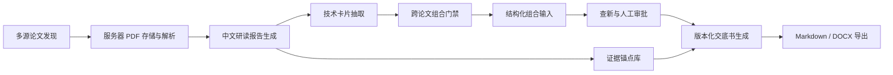
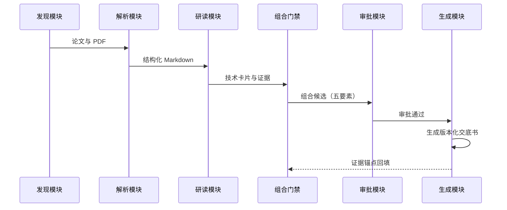

# 技术交底书

## 基本信息

- 发明名称：一种基于跨论文技术组合与证据溯源的专利交底书自动生成方法及系统
- 技术领域：人工智能基础设施（AI Infra）、自然语言处理、专利辅助撰写
- 技术联系人：待填写
- 版本状态：候选草案

> 说明：本文档是技术交底书候选草案，用于内部技术披露与专利撰写参考，不构成法律意义上的新颖性、创造性或可授权结论。最终权利要求范围需由专利代理人与法务复核。

---

## 一、现有技术及其问题

### 1.1 现有技术

在论文研读与专利撰写辅助领域，现有方案通常包括：

1. **单篇论文摘要改写工具**：仅对单篇论文的摘要或正文进行改写，无法形成跨论文的组合技术方案，容易退化为机械摘要拼接。
2. **通用大模型问答/写作助手**：可生成文本，但缺乏对论文证据的可追溯引用，生成内容无法核验事实来源，存在幻觉风险。
3. **专利检索与查新系统**：仅提供在先文献检索，不负责从论文中抽取技术问题、方法、组件并组织成可实施的技术方案。
4. **人工撰写交底书**：依赖工程师逐篇阅读论文、人工判断组合关系、人工整理证据，效率低且难以保证证据可追溯。

### 1.2 现有技术的不足

- **缺乏跨论文组合能力**：单篇改写无法覆盖需要多篇论文机制协同才能解决的系统级问题。
- **缺乏组合门禁**：无法自动判断多篇论文是否构成真正的技术耦合，容易把摘要机械拼接成看似合理的方案。
- **缺乏证据溯源**：生成内容无法回溯到具体论文的段落、页码与证据锚点，难以支撑专利审查中的事实核验。
- **缺乏人工审批闭环**：缺少「查新 → 人工审批 → 生成草稿」的受控流程，容易在未核验新颖性/创造性风险的情况下直接产出草稿。

---

## 二、发明目的

在保留来源论文可追溯证据的前提下，将多篇论文中的技术机制组合为一个可工程实现的系统方案，并通过组合门禁、证据溯源与人工审批闭环，解决单篇方案难以覆盖的性能、成本、质量或资源利用率问题，同时避免机械摘要拼接与不可核验的生成内容。

---

## 三、技术方案

### 3.1 总体架构

本方案涉及一种论文研读与专利交底书自动生成系统，包括以下核心模块：

### 3.2 模块组成与连接关系

1. **多源论文发现模块**：从 arXiv、Hugging Face、OpenReview、OpenAlex 等多来源抓取论文，采用可配置的滚动回看窗口（默认 7 天），并以规范化身份标识进行幂等去重，避免重复入库。
2. **服务器 PDF 存储与解析模块**：将论文 PDF 保存到服务器，调用文档结构化引擎（如 MinerU）解析为结构化 Markdown 与章节引用。
3. **中文研读报告生成模块**：通过 OpenAI 兼容接口或 Dify 工作流，对解析后的论文生成结构化中文研读报告（摘要、动机、方法、实验、结果、创新点、局限、工程价值、复现计划）。
4. **技术卡片抽取模块**：从研读报告中抽取技术问题、方法、系统组件、指标、风险与证据锚点，形成结构化技术卡片。
5. **跨论文组合门禁模块**：对候选技术卡片执行组合门禁检查，包括：至少两张卡片、明确技术问题、可实施方法、方法差异度、来源证据存在性，过滤机械摘要拼接。
6. **结构化组合输入模块**：要求用户填写耦合关系、接口边界、数据/控制流、非并列说明、联合效果五要素，确保组合不是简单并列。
7. **查新与人工审批模块**：对候选执行在先技术查新，查新任务成功后才允许普通审批；支持带警告的人工 override 审批并记录原因。
8. **版本化交底书生成模块**：审批通过后生成版本化交底书（Markdown + DOCX），DOCX 渲染包含 Mermaid 图，并保留证据溯源。

### 3.3 数据与控制流程

### 3.4 关键实施方式

1. 从论文研读报告中抽取技术问题、系统组件、核心方法和实验约束，形成技术卡片。
2. 对候选技术卡片执行组合门禁检查，过滤机械摘要拼接。
3. 将互补方法映射到统一系统流程，明确输入、处理阶段、调度策略和输出。
4. 对每个关键主张保留来源证据锚点，并标注需要新增实验验证的部分。
5. 在每个执行阶段采集性能、资源和质量指标，并将反馈用于后续阶段参数更新。
6. 在查新成功与人工审批通过后，才允许生成交底书草稿。

---

## 四、有益效果

- **提升组合质量**：通过组合门禁与五要素结构化输入，避免机械摘要拼接，生成真正具有技术耦合的方案。
- **增强可追溯性**：每个技术主张绑定来源论文证据锚点，支持专利审查中的事实核验。
- **降低风险**：通过查新 + 人工审批闭环，在生成草稿前识别新颖性/创造性风险。
- **提高效率**：自动化论文发现、解析、研读、组合与草稿生成，显著减少人工撰写工作量。

上述效果属于待验证的工程预期，需通过与各来源单独方案、简单并列方案及现有基线的对照实验确认。

---

## 五、建议保护点

1. 一种跨论文技术组合的专利交底书自动生成方法，其特征在于：从多篇论文的研读报告中抽取技术卡片，对所述技术卡片执行组合门禁检查，基于通过门禁的卡片生成包含耦合关系、接口边界、数据/控制流、非并列说明与联合效果的结构化组合输入，并在查新成功与人工审批通过后生成版本化交底书。
2. 根据保护点 1 所述的方法，其特征在于：所述组合门禁检查包括至少两张卡片、明确技术问题、可实施方法、方法差异度与来源证据存在性中的至少一项。
3. 根据保护点 1 所述的方法，其特征在于：所述技术卡片包含技术问题、方法、系统组件、指标、风险与证据锚点，所述证据锚点关联来源论文的段落、页码与引用。
4. 根据保护点 1 所述的方法，其特征在于：所述查新与人工审批包括在先技术查新任务，仅在查新任务成功后允许普通审批，并支持带警告的人工 override 审批且记录原因。
5. 一种实现上述方法的系统，包括多源论文发现模块、服务器 PDF 存储与解析模块、中文研读报告生成模块、技术卡片抽取模块、跨论文组合门禁模块、结构化组合输入模块、查新与人工审批模块以及版本化交底书生成模块。
6. 一种存储计算机程序的计算机可读存储介质，所述程序被处理器执行时实现上述方法。

---

## 六、组合门禁、证据与风险

- 组合门禁：至少两张技术卡片、明确技术问题、可实施方法、方法差异度、来源证据存在性。
- 证据溯源：每个技术主张绑定来源论文证据锚点。
- 风险提示：需人工核验事实来源、保护范围、新颖性、创造性、侵权风险和论文许可边界。

---

## 七、实验验证与可选实施例

- 分别实现来源方法、简单并列方法和本方案的耦合实现，比较吞吐、尾延迟、资源利用率与任务质量。
- 对状态采样频率、决策周期、资源上限和回退策略进行消融实验。
- 在训练、在线推理、离线批处理或异构设备环境中验证替代实施方式。
- 对来源论文未披露的工程接口、异常处理和边界条件补充实现细节。

---

## 八、附图清单

- 图 1：系统总体架构图（见 3.1 Mermaid 图）
- 图 2：数据与控制时序图（见 3.3 Mermaid 图）
- 图 3：可选的调度策略状态机
- 图 4：关键模块数据结构图

---

## 九、待人工补充

- 具体实验数据
- 与公开在先方案的差异表
- 可选实施例
- 权利要求范围边界
